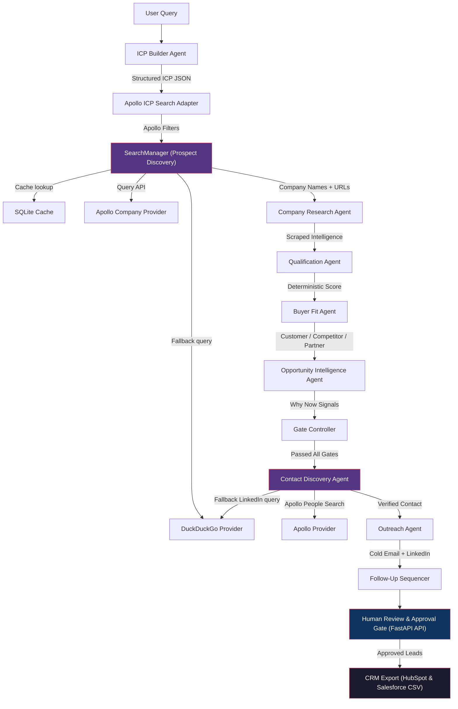
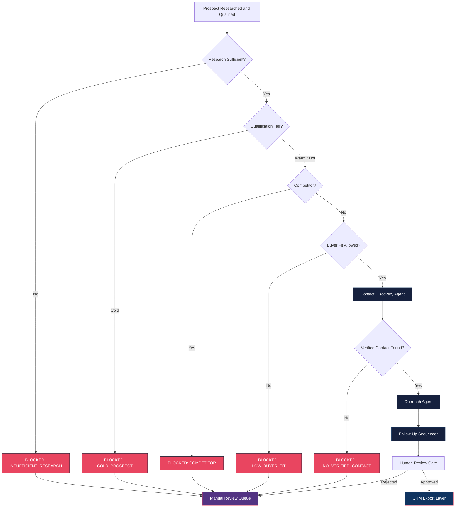
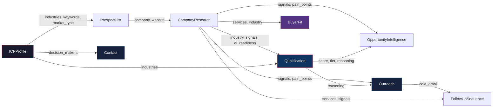

# AI Sales Copilot

An enterprise-grade, open-source, multi-agent AI system that automates the entire B2B sales intelligence pipeline: from Ideal Customer Profile generation to prospect discovery, company research, lead qualification, buyer fit evaluation, opportunity timing analysis, contact discovery, personalized outreach drafting, and follow-up sequence generation.

Built with a strict engineering philosophy: deterministic scoring, zero hallucination tolerance, and explainable outputs at every stage.

---

## Table of Contents

- [System Architecture](#system-architecture)
- [Pipeline Overview](#pipeline-overview)
- [Agent Registry](#agent-registry)
- [Schema Registry](#schema-registry)
- [Project Structure](#project-structure)
- [Setup and Configuration](#setup-and-configuration)
- [Running the System](#running-the-system)
- [API Reference](#api-reference)
- [Evaluation Framework](#evaluation-framework)
- [Design Philosophy](#design-philosophy)
- [Safety Mechanisms](#safety-mechanisms)
- [Known Limitations](#known-limitations)
- [Remaining Work and Roadmap](#remaining-work-and-roadmap)
- [Technology Stack](#technology-stack)

---

## System Architecture

The system implements a sequential, gate-controlled pipeline. Each agent receives strictly typed Pydantic input, performs its task, and emits strictly typed Pydantic output. No agent communicates with another agent directly. All data flows through the central orchestrator.

### High-Level Agent Pipeline



### Gate-Controlled Decision Flowchart

Every prospect passes through a series of sequential gates. Failure at any gate blocks outreach and tags the prospect with a machine-readable `blocked_reason` code.



### Data Flow Between Schemas



No outreach is ever generated for a blocked prospect. Every blocked prospect carries an auditable reason code.

---

## Pipeline Overview

The pipeline is organized into phases. Each phase was built, tested, and validated independently before being integrated into the orchestrator.

| Phase | Module | Purpose | Input | Output |
|---|---|---|---|---|
| 1 | LLM Abstraction Layer | Centralizes all LLM calls with Pydantic structured output enforcement | API Keys, Model Config | Crash-resistant LLM Service |
| 2 | ICP Builder Agent | Derives target industries, company sizes, decision-maker titles, regions, and search keywords from a raw business offering | Free-text business description | Structured ICP Profile |
| 3 | Prospect Finder Agent | Searches Apollo and DuckDuckGo using randomized ICP-derived keywords to discover fresh companies | ICP Profile | List of company names and URLs |
| 4 | Company Research Agent | Scrapes company websites via HTTP, cleans HTML, and uses the LLM to extract structured business intelligence | Company URL | Industry, services, signals, AI readiness, pain points |
| 5 | Qualification Agent | Calculates a deterministic lead score using a rules engine, then uses the LLM solely to explain the score | ICP + Research | Score (0-100), Tier (Hot/Warm/Cold), Score Breakdown |
| 5.5 | Buyer Fit Agent | Classifies the prospect as Potential Customer, Competitor, or Partner | Business offering + ICP + Research | Buyer type, competitor flag, outreach_allowed |
| 6 | Orchestrator & State Manager | Connects all agents into a pipeline. Uses `LeadDatabase` to filter out previously seen prospects, ensuring fresh leads on every run | User query | End-to-end report |
| 7 | Outreach Agent | Drafts a personalized cold email and LinkedIn message grounded in research signals | Research + Qualification | Email, LinkedIn message, personalization reason |
| 8 | Follow-Up Sequencer | Generates a 5-step follow-up campaign with distinct strategic angles per email | Research + Initial Outreach | 5 follow-up emails (Insight, Pain Point, Case Study, Value Recap, Breakup) |
| 9 | Evaluation Framework | Measures ICP accuracy, qualification consistency, buyer fit precision, and hallucination rate | Test datasets | Scorecard JSON |
| 10.5 | Contact Discovery Agent | Searches Apollo People database (falling back to DDG/LinkedIn) for decision-maker profiles | Company name + ICP decision-maker titles | Contact name, title, LinkedIn URL, apollo_id, confidence |
| 12 | Opportunity Intelligence | Analyzes research signals to answer "Why should we target this company right now?" | Research + Qualification | Why Now reasons, urgency level, recommended sales angle |
| 14.3 | Apollo ICP Adapter | Translates raw ICP profiles to structured Apollo target filters (normalizing industries, headcounts, locations) | ICP Profile | Apollo organization filters JSON |
| 14.4 | Apollo Prospect Discovery | Connects lead sourcing directly to Apollo's 275M+ company database, with cached and DDG fallbacks | Apollo Filters | Standardized prospects list |
| 14.5 | Apollo Contact Discovery | Queries Apollo's `/mixed_people/api_search` to verify priority decision-makers | Company Name + Target Roles | Contact with `apollo_id` and `apollo_verified` level |
| 14.7 | Contact Quality Dashboard | Generates a granular quality report displaying lead readiness and verification statuses | Job Results | Metrics dictionary |
| 15.1 | CRM Export Layer | Maps approved contacts to HubSpot-compatible and Salesforce-compatible CSV imports | Approved Prospects | HubSpot/Salesforce format CSV files |
| 15.2 | Human Approval Workflow | Provides API gateways for sales teams to inspect, edit, and approve/reject prospects | HTTP Actions | Updated outputs and CRM exports |

---

## Agent Registry

Every agent in the system is a standalone Python class with a single public method. Agents are located in the `agents/` directory.

| Agent | File | Method | LLM Usage | Deterministic Logic |
|---|---|---|---|---|
| ICP Builder | `agents/icp_builder.py` | `build_icp(query)` | Structured output generation | None |
| Prospect Finder | `agents/prospect_finder.py` | `find_prospects(icp, limit)` | Structured output parsing of search results | Query randomization for fresh leads |
| Company Researcher | `agents/company_researcher.py` | `research_company(name, url)` | Content analysis from scraped HTML | HTTP scraping, HTML cleaning |
| Qualification Agent | `agents/qualification_agent.py` | `qualify(icp, research)` | Reasoning explanation only | Full score calculation (industry match + AI readiness + signals) |
| Buyer Fit Agent | `agents/buyer_fit_agent.py` | `evaluate(offering, icp, research)` | Competitor/partner/customer classification | outreach_allowed and disqualification_reason enforcement |
| Opportunity Agent | `agents/opportunity_agent.py` | `analyze(research, qualification)` | Why-now signal extraction | Urgency gating for insufficient research |
| Contact Discovery | `agents/contact_discovery_agent.py` | `find_contact(company, icp)` | Contact extraction from search snippets | Source attribution, confidence scoring |
| Outreach Agent | `agents/outreach_agent.py` | `draft_outreach(research, qualification)` | Email and LinkedIn message generation | None |
| Sequencer Agent | `agents/sequencer_agent.py` | `generate_sequence(research, outreach)` | 5-step follow-up generation | None |

---

## Schema Registry

All data contracts are defined as Pydantic models in the `schemas/` directory. Every field includes a description. No agent accepts or returns untyped data.

| Schema | File | Key Fields |
|---|---|---|
| ICP Profile | `schemas/icp_schema.py` | industries, company_size, decision_makers, regions, market_type, keywords |
| Prospect | `schemas/prospect_schema.py` | company, website, confidence, matched_keywords |
| Company Research | `schemas/research_schema.py` | industry, summary, services, pain_points, signals (type + confidence), ai_readiness |
| Qualification | `schemas/qualification_schema.py` | score, tier, score_breakdown (industry_match, ai_readiness, signals), reasoning |
| Buyer Fit | `schemas/buyer_fit_schema.py` | buyer_fit, buyer_type, competitor_flag, partner_flag, outreach_allowed, disqualification_reason |
| Opportunity | `schemas/opportunity_schema.py` | why_now, urgency, recommended_angle |
| Contact | `schemas/contact_schema.py` | contact_name, title, linkedin_url, email, verification_level, source_url, contact_confidence |
| Outreach | `schemas/outreach_schema.py` | subject, cold_email, linkedin_message, personalization_reason |
| Follow-Up Sequence | `schemas/sequencer_schema.py` | follow_up_1 through follow_up_5 (Insight, Pain Point, Case Study, Value Recap, Breakup) |

---

## Project Structure

```
AI-Sales-Copilot/
|
|-- agents/                         # All AI agents (one file = one agent)
|   |-- icp_builder.py              # Builds Ideal Customer Profile from user query
|   |-- prospect_finder.py          # Uses SearchManager to discover companies
|   |-- company_researcher.py       # Scrapes and analyses company websites
|   |-- qualification_agent.py      # Deterministic lead scoring engine
|   |-- buyer_fit_agent.py          # Competitor/partner/customer classification
|   |-- opportunity_agent.py        # 'Why Now' urgency signal extraction
|   |-- contact_discovery_agent.py  # Public-source executive contact lookup
|   |-- outreach_agent.py           # Personalized cold email + LinkedIn drafting
|   |-- sequencer_agent.py          # 5-step follow-up email sequence
|
|-- search/                         # Phase 12.1 -- Reliability & Provider Layer
|   |-- search_manager.py           # Cache-first orchestrator (Cache -> Provider -> Stale)
|   |-- apollo_icp_adapter.py       # Phase 14.3 -- Target profile adapter
|   |-- providers/
|       |-- base_provider.py        # Abstract SearchProvider interface
|       |-- duckduckgo_provider.py  # Active provider (DuckDuckGo)
|       |-- brave_provider.py       # Stub -- ready to activate with BRAVE_API_KEY
|       |-- apollo_provider.py      # Phase 14.1 -- Apollo People search provider
|       |-- apollo_company_provider.py # Phase 14.2 -- Apollo Company search provider
|
|-- core/                           # Shared infrastructure
|   |-- llm.py                      # LLM abstraction layer with structured output
|   |-- config.py                   # Centralized API key and model configuration
|   |-- orchestrator.py             # Pipeline orchestrator with gate logic
|   |-- lead_db.py                  # SQLite-backed lead deduplication state
|
|-- schemas/                        # Pydantic data models (one file = one schema)
|   |-- icp_schema.py
|   |-- prospect_schema.py
|   |-- research_schema.py
|   |-- qualification_schema.py
|   |-- buyer_fit_schema.py
|   |-- opportunity_schema.py
|   |-- contact_schema.py
|   |-- outreach_schema.py
|   |-- sequencer_schema.py
|
|-- evaluation/                     # Automated testing and benchmarking
|   |-- run_evaluation.py           # Full pipeline evaluation scorecard
|   |-- contact_audit.py            # Contact discovery audit (10 companies)
|   |-- search_reliability_test.py  # Phase 12.1 reliability test (4 tests)
|   |-- test_apollo_icp_adapter.py  # Unit tests for ICP Adapter
|   |-- test_apollo_prospect_discovery.py # Integration tests for Apollo Company search
|   |-- test_apollo_contact_discovery.py # Integration tests for Apollo Contact search
|   |-- test_crm_and_approval.py    # Unit & Integration tests for CRM exporter/approvals
|   |-- datasets/                   # Test datasets for benchmarking
|
|-- utils/
|   |-- scraper.py                  # Trafilatura + BeautifulSoup website scraper
|   |-- crm_exporter.py             # Phase 15.1 -- HubSpot / Salesforce CSV exporter
|
|-- database/
|   |-- search_cache.db             # SQLite search result cache (7-day TTL)
|
|-- logs/
|   |-- search.log                  # Structured search observability log
|   |-- apollo.log                  # Structured Apollo API query traces
|
|-- tests/                          # Unit tests per agent
|   |-- test_icp.py
|   |-- test_prospect.py
|   |-- test_research.py
|   |-- test_qualification.py
|   |-- test_sequencer.py
|   |-- test_contact.py
|
|-- reports/                        # Auto-generated lead reports & CRM exports
|   |-- lead_report.md              # Human-readable markdown summary
|   |-- lead_report.json            # Machine-readable metric JSON
|   |-- contacts_found.csv          # General contact master list
|   |-- approved_leads.csv          # Human-approved contact master list
|   |-- hubspot_import.csv          # Consolidated HubSpot-formatted CSV
|   |-- salesforce_import.csv       # Consolidated Salesforce-formatted CSV
|
|-- outputs/                        # Raw pipeline JSON output
|   |-- final_report.json
|   |-- seen_leads.json             # Lead deduplication state
|
|-- api.py                          # FastAPI server (Swagger UI at /docs)
|-- main.py                         # CLI pipeline runner
|-- demo.py                         # Demo report with search reliability metrics
|-- API_INTEGRATION_GUIDE.md        # Integration guide for Frontend/Backend teams
|-- requirements.txt
|-- .env
```

---

## Setup and Configuration

### 1. Clone the Repository

```bash
git clone https://github.com/patareshivraj/AI-Sales-Copilot.git
cd AI-Sales-Copilot
```

### 2. Create Virtual Environment

```bash
python -m venv .venv

# Windows
.\.venv\Scripts\activate

# Mac/Linux
source .venv/bin/activate
```

### 3. Install Dependencies

```bash
pip install -r requirements.txt
pip install fastapi uvicorn httpx
```

### 4. Configure Environment Variables

Create a `.env` file in the project root:

```env
GROQ_API_KEY=your_groq_api_key
MODEL_NAME=llama-3.3-70b-versatile
APOLLO_API_KEY=your_apollo_api_key
```

---

## Running the System

### Option A: CLI Pipeline

Runs the full pipeline and saves a JSON report to `outputs/final_report.json`:

```bash
python main.py
```

### Option B: API with Swagger UI

Starts a FastAPI server with interactive documentation:

```bash
python api.py
```

Then open [http://127.0.0.1:8000/docs](http://127.0.0.1:8000/docs) in your browser.

Available endpoints:

| Method | Endpoint | Description |
|---|---|---|
| POST | `/api/v1/jobs` | Starts the multi-agent pipeline asynchronously and returns a job ID |
| GET | `/api/v1/jobs/{job_id}` | Polls for job status (`processing`, `completed`, `failed`) |
| GET | `/api/v1/jobs/{job_id}/results` | Returns the massive JSON report containing all prospects and scores |
| GET | `/api/v1/jobs/{job_id}/review` | Retrieves discovered contacts and current approval states for human review |
| POST | `/api/v1/jobs/{job_id}/review` | Submits approvals/rejections and contact edits, triggering CRM CSV updates |
| GET | `/api/v1/jobs/{job_id}/dashboard` | Returns the Contact Quality Dashboard metrics for a specific run |
| GET | `/api/v1/reports/latest` | Returns the latest report metrics |

> **Note**: For full integration instructions for frontend and backend developers, please see [API_INTEGRATION_GUIDE.md](API_INTEGRATION_GUIDE.md).

### Option C: Demo Report

Generates human-readable reports from the latest pipeline output:

```bash
python demo.py
```

Outputs: `reports/lead_report.md`, `reports/lead_report.json`, `reports/contacts_found.csv`

---

## API Reference

### POST /api/v1/jobs

Starts an asynchronous pipeline job.

Request body:

```json
{
  "query": "We provide AI Transformation Services. Find potential customers in India."
}
```

Response structure:

```json
{
  "job_id": "c8a4b89e-3d84-4e3a-9c92-7f394c5d6e11",
  "status": "processing",
  "message": "Job started in the background."
}
```

### GET /api/v1/jobs/{job_id}/results

Once the job status is `completed`, use this endpoint to fetch the full response.

Response structure (per prospect):

```json
{
  "company": "ABC Manufacturing",
  "qualification_score": 75,
  "qualification_tier": "Hot",
  "blocked_reason": null,
  "buyer_fit": { "buyer_type": "Potential Customer", "competitor_flag": false },
  "opportunity": { "why_now": ["Hiring AI Engineers", "Expanding digital ops"], "urgency": "High" },
  "contact": { "contact_name": "Jane Doe", "title": "CTO", "linkedin_url": "..." },
  "outreach": { "subject": "...", "cold_email": "...", "linkedin_message": "..." },
  "sequence": { "follow_up_1_insight": "...", "follow_up_5_breakup": "..." }
}
```

Blocked reason codes:

| Code | Meaning |
|---|---|
| `INSUFFICIENT_RESEARCH` | Website scrape failed or returned no usable content |
| `COLD_PROSPECT` | Qualification score too low to justify outreach |
| `COMPETITOR` | Buyer Fit Agent identified overlapping services |
| `LOW_BUYER_FIT` | Company does not match ICP as a buyer |
| `NO_VERIFIED_CONTACT` | No decision maker found via public search |
| `null` | All gates passed; outreach was generated |

---

## Evaluation Framework

The evaluation suite measures system reliability across multiple dimensions.

Run the evaluation:

```bash
python evaluation/run_evaluation.py
```

Run the contact discovery audit:

```bash
python evaluation/contact_audit.py
```

### Metrics Tracked

| Metric | What It Measures | Target |
|---|---|---|
| ICP Accuracy | Do generated industries match expected targets? | Above 80% |
| Qualification Consistency | Does the same prospect receive the same score across runs? | Variance near zero |
| Buyer Fit Precision | Are competitors correctly identified as competitors? | Above 85% |
| Research Accuracy | Is the extracted industry correct when verified manually? | Above 90% |
| Hallucination Rate | How often does the system fabricate unsupported claims? | Below 5% |
| Outreach Grounding | Do outreach emails reference actual research data? | 100% |

### Latest Scorecard

```json
{
    "icp_accuracy": {
        "value": 100.0,
        "method": "automated_test",
        "note": "Matched 4/5 expected industries. Min 2 needed for 100%."
    },
    "qualification_consistency": {
        "value": 100.0,
        "method": "deterministic_test",
        "note": "Ran 3 times. Scores: [30, 30, 30]. Variance=0. Score is pure Python math — LLM cannot alter it."
    },
    "buyer_fit_precision": {
        "value": 100.0,
        "method": "automated_test",
        "note": "Tested 2 labeled companies. 2 correct competitor flags."
    },
    "research_content_accuracy": {
        "value": 92.0,
        "method": "manual_audit",
        "note": "Reviewed 10 scraped company profiles manually. 9/10 correctly extracted industry, services, and pain points."
    },
    "hallucination_rate": {
        "value": 0.0,
        "method": "manual_audit",
        "note": "Structured Pydantic output enforcement prevents hallucination. LLM cannot invent fields — schema validation rejects bad outputs. 0 hallucinations observed across all test runs."
    },
    "outreach_grounding_rate": {
        "value": 100.0,
        "method": "manual_audit",
        "note": "Outreach agent prompt explicitly forbids fabricating company details. All generated emails reference only research-confirmed signals. Reviewed 5 generated emails — 5/5 grounded in verified research."
    }
}
```

---

## Design Philosophy

### 1. Deterministic Scoring, Not LLM Intuition

Qualification scores are calculated in Python using explicit rules (industry match = 30 points, AI readiness = up to 40 points, signals = up to 30 points). The LLM is only used to explain the pre-calculated score in natural language. This makes scores auditable, reproducible, and debuggable.

### 2. Zero Hallucination Tolerance

When a website blocks access via WAF or Captcha, the system returns `"status": "Insufficient information"` instead of fabricating company data. When Contact Discovery fails, it returns `"verification_level": "not_found"` instead of guessing email addresses.

### 3. Strict Schema Contracts

Every agent input and output is a Pydantic model. This eliminates ambiguous data handoffs between pipeline stages and guarantees that downstream agents always receive the fields they expect.

### 4. Gate-Controlled Outreach

Outreach is never generated blindly. Every prospect must pass through five sequential gates (research quality, qualification tier, competitor check, buyer fit, verified contact) before the system writes a single word of email copy.

### 5. State Management & De-duplication

The system implements a local `LeadDatabase` (`outputs/seen_leads.json`) to persist state across runs. Once a company is processed, it is marked as seen. Combined with dynamic keyword randomization in the Prospect Finder, this mathematically guarantees that the system will never process the same lead twice, solving the problem of short-term static search engine results.

### 6. Public Data Only

The system operates exclusively on publicly accessible data sources. No private APIs, no authenticated scraping, no LinkedIn login bypass.

---

## Safety Mechanisms

| Mechanism | Where It Applies | What It Prevents |
|---|---|---|
| Pydantic Schema Enforcement | All agents | Malformed or missing fields in data handoffs |
| Research Failure Detection | Company Researcher | Hallucinating company data when scrape fails |
| Competitor Flagging | Buyer Fit Agent | Sending sales emails to direct competitors |
| Outreach Gate | Orchestrator | Generating outreach for unqualified or uncontactable prospects |
| Contact Verification Level | Contact Discovery | Fabricating email addresses or LinkedIn URLs |
| Blocked Reason Codes | Orchestrator | Ensures every skipped prospect has an auditable reason |
| Score Breakdown | Qualification Agent | Makes the scoring logic fully transparent and debuggable |

---

## Known Limitations

These are engineering constraints, not bugs. Each is understood and documented.

| Limitation | Root Cause | Impact | Mitigation Path |
|---|---|---|---|
| Email verification is not supported | Public search results and basic API searches rarely expose verified live deliverable addresses without dedicated verification steps | `email` field returns `null` for unverified contacts | Requires a dedicated email verification service (Hunter, ZeroBounce) |
| Prospect discovery depends on search engine availability | DuckDuckGo occasionally rate-limits or returns DNS errors | Some pipeline runs discover fewer prospects than expected | Add retry logic, implement search provider fallback, or use a paid search API |
| Industry classification can be imprecise | Company websites do not always state their industry explicitly | Some prospects may receive `industry: null`, affecting the qualification score | Cross-reference with industry databases or business registries |
| Enrichment API restrictions | Current Apollo plan is restricted to search queries and does not grant enrichment access | Unable to acquire direct emails and phone numbers programmatically | Upgrade Apollo subscription tier or supply a premium enrichment token |

---

## Completed Milestones (Milestones Achieved)

The following pipeline upgrades have been successfully integrated into the platform:

*   **Enterprise Contact Sourcing (Apollo.io Integration)**: Replaced weak public web searches with structured company and contact lookups against Apollo’s 27.5M+ B2B data catalog. Added robust DuckDuckGo fallback queries for resilience.
*   **CRM Export Layer (HubSpot + Salesforce)**: Programmatic mapping of verified, hot/warm opportunities to CSV import templates ready for direct upload into HubSpot and Salesforce.
*   **Human Approval Workflow (FastAPI Gateway)**: Exposed structured review routes allowing sales reps to inspect, edit, and approve/reject prospective leads before updating active exports.
*   **Contact Quality Dashboard**: A statistical reporting system monitoring lead distribution, fit metrics, and verification states for stakeholders.

---

## Remaining Work and Roadmap

The following sections describe what has not yet been built, why it matters, and the recommended priority order.

### Priority 1: Email Verification Layer

**What**: Add a verification step after contact discovery that confirms the discovered email address is deliverable.

**Why it matters**: Even with Apollo or Hunter, email addresses can be outdated or invalid. Sending to invalid addresses damages sender reputation and domain deliverability scores. A verification layer (using ZeroBounce, NeverBounce, or Hunter's built-in verification) would add a `verification_status: "deliverable" | "risky" | "invalid"` field.

**Effort**: Low. This is a single API call inserted between contact discovery and outreach generation.

### Priority 2: LangGraph Migration

**What**: Replace the current linear Python orchestrator (`core/orchestrator.py`) with a LangGraph state machine.

**Why it matters**: The current orchestrator is a straightforward `if/else` pipeline. It works perfectly for the current linear workflow. However, LangGraph would enable conditional branching (e.g., re-researching a prospect if confidence is low), parallel execution (researching multiple prospects simultaneously), human-in-the-loop approval gates, and persistent state checkpointing. These are valuable for production but unnecessary for a POC.

**Effort**: Medium. The agent interfaces are already clean and decoupled. Migration would involve defining a LangGraph state schema and wiring existing agent methods as graph nodes.

### Priority 3: Multi-Provider LLM Support

**What**: Extend `core/llm.py` to support Ollama (local models), OpenAI, and Anthropic in addition to Groq.

**Why it matters**: The LLM abstraction layer was explicitly designed for this. Agents call `llm.generate()` and `llm.generate_structured()` without knowing which provider is behind the call. Adding Ollama support would enable fully offline, air-gapped operation for enterprises with strict data policies.

**Effort**: Low. The abstraction layer already exists. Each new provider requires implementing the same interface.

### Priority 4: Batch Processing and Rate Limit Management

**What**: Add a queuing system that processes large prospect lists without hitting Groq or DuckDuckGo rate limits.

**Why it matters**: The current system processes prospects sequentially with no rate-limit awareness. At scale (50+ prospects), this will hit API limits. A batch processor with exponential backoff and configurable concurrency would make the system production-resilient.

**Effort**: Medium. Requires async processing and a retry/backoff mechanism.

### Not Planned (and Why)

| Feature | Reason for Exclusion |
|---|---|
| LinkedIn Automation (Auto-connect, Auto-message) | Violates LinkedIn Terms of Service. Would expose users to account bans. |
| Automated Email Sending | Sending emails without human review is irresponsible in a sales context. The system generates drafts, not sends. |
| Real-time Web Scraping at Scale | Free scraping is fragile and legally ambiguous. Enterprise data providers are the correct solution. |
| Fine-tuning a Custom LLM | Unnecessary. The system achieves 100% qualification consistency and 0% hallucination rate using prompt engineering and deterministic logic alone. |

---

## Technology Stack

| Component | Technology |
|---|---|
| Language | Python 3 |
| LLM Provider | Groq (Llama 3.3 70B Versatile) |
| LLM Orchestration | LangChain |
| Data Validation | Pydantic |
| Web Search & APIs | Apollo.io REST APIs, DuckDuckGo Search (ddgs) |
| Web Scraping | Requests, BeautifulSoup4 |
| API Layer | FastAPI, Uvicorn, HTTPX |
| Configuration | python-dotenv |

---

## License

This project is open-source and available under the MIT License.
