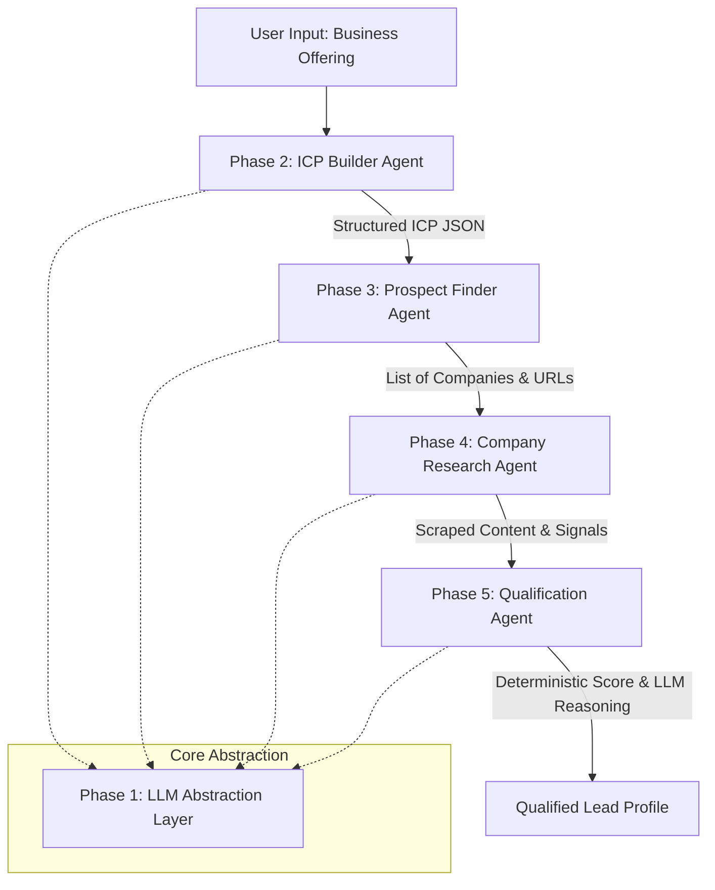

# AI Sales Copilot

An enterprise-grade, open-source AI Sales Copilot designed to automate and scale B2B sales prospecting, research, and qualification. The system leverages a multi-agent architecture to autonomously identify Ideal Customer Profiles (ICPs), discover highly relevant enterprise prospects using public data, and perform deterministic qualification scoring.

---

## System Architecture

The overarching design implements a sequential, state-driven workflow where agents pass tightly typed, validated JSON structures to one another. This eliminates open-ended agent "chatter" and enforces deterministic handoffs.



## Project Scope and Agent Responsibilities

The project is structured into discrete, highly decoupled phases. Each phase acts as a standalone module that can be tested and validated independently.

| Phase | Module Name | Primary Input | Core Process | Output | Status |
|---|---|---|---|---|---|
| **Phase 1** | Foundation Layer | API Keys, Model Config | Centralizes all LLM interactions, enforcing structured output via Pydantic. | Crash-resistant LLM Service | Complete |
| **Phase 2** | ICP Builder Agent | Raw Business Offering | Deduces target industries, decision-makers, company sizes, and search keywords. | Structured ICP Profile | Complete |
| **Phase 3** | Prospect Finder Agent | Structured ICP Profile | Queries DuckDuckGo dynamically based on generated keywords and target markets. | List of Prospect URLs | Complete |
| **Phase 4** | Company Research | Prospect URL | Scrapes website HTML, removes noise, and evaluates AI readiness and growth signals. | Extracted Company Context | Complete |
| **Phase 5** | Qualification Agent | Research Context & ICP | Calculates deterministic lead score based on industry, AI readiness, and signals. | Tiered Score & Reasoning | Complete |
| **Phase 6** | Orchestration | - | Connects all previous phases into a seamless automated pipeline. | End-to-End Pipeline | Pending |

## Technology Stack

* **Language**: Python 3
* **LLM Orchestration**: LangChain, LangGraph
* **Inference**: Groq API (High-speed Llama-3 generation)
* **Data Validation**: Pydantic
* **Search / Data Sourcing**: DuckDuckGo Search (`ddgs`)
* **Web Scraping**: Requests, BeautifulSoup4

---

## Setup and Configuration

### 1. Clone the Repository
```bash
git clone https://github.com/patareshivraj/AI-Sales-Copilot.git
cd AI-Sales-Copilot
```

### 2. Set Up Virtual Environment
```bash
python -m venv .venv
# On Windows
.\.venv\Scripts\activate
# On Mac/Linux
source .venv/bin/activate
```

### 3. Install Dependencies
```bash
pip install -r requirements.txt
```

### 4. Configure Environment Variables
Create a `.env` file in the root directory:
```env
GROQ_API_KEY=your_groq_api_key_here
MODEL_NAME=llama-3.3-70b-versatile
```

---

## Validation and Testing

The system is highly test-driven. You can validate the discrete agents using the built-in test scripts without running the entire pipeline.

**Test the LLM Abstraction Layer:**
```bash
python validation_tests.py
```

**Test the ICP Builder Agent:**
```bash
python tests/test_icp.py
```

**Test the Prospect Finder Agent:**
```bash
python tests/test_prospect.py
```

**Test the Company Researcher Agent:**
```bash
python tests/test_research.py
```

**Test the Qualification Agent:**
```bash
python tests/test_qualification.py
```

---

## Design Philosophy

1. **No Hallucinations**: We enforce strict schema parsing using Pydantic. If an input is invalid, or a website blocks access (via WAF/Captcha), the system gracefully populates an `error` field rather than guessing or fabricating data.
2. **Deterministic Handoffs**: Agents do not chat with each other in an open-ended way. Data flows via tightly typed JSON objects.
3. **Hybrid Scoring**: Qualification scoring is deterministic (calculated mathematically via Python). The LLM is only utilized to explain the math in natural language, ensuring total transparency.
4. **Public Data Only**: The copilot strictly operates on publicly accessible search and website data. No private scraping or authenticated bypasses are utilized.
